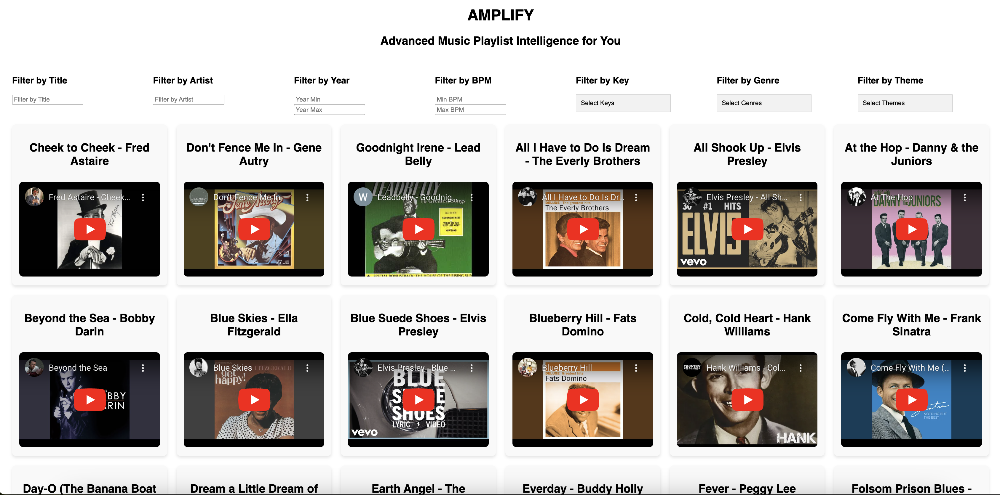

# AMPLIFY (Advanced Music Playlist Intelligence for You)

**AMPLIFY** is a modern music management application designed to provide users with advanced playlist filtering and discovery tools. Developed with the unique needs of **music therapists** in mind, AMPLIFY offers precise and customizable tools to help professionals and enthusiasts alike curate the perfect playlists for their sessions. Every song's key, meter, and tempo (BPM) were personally checked and verified by ear, ensuring accuracy and reliability.

## Features

- 🎵 **Comprehensive Song Database**
  - Store detailed metadata about songs, including title, artist, release year, key, tempo (BPM), genres, themes, and YouTube links.
  - Verified key, meter, and BPM values for each track, personally assessed for precision.

- 🔍 **Advanced Filtering**
  - Filter songs by:
    - Title and artist
    - Release year range
    - Key (e.g., C major, G minor)
    - Tempo (BPM range)
    - Genres and themes

- 🎛 **User-Friendly Interface**
  - A responsive Vue.js frontend for seamless navigation and usability.
  - Dropdowns and checkboxes for easy selection of keys, genres, and themes.

- 🔗 **YouTube Integration**
  - Watch embedded YouTube videos of songs directly within the app.

## Tech Stack

### Backend
- **Java & Spring Boot**: Backend logic, RESTful APIs, and database management.
- **PostgreSQL**: Relational database for managing users, songs, genres, and themes.

### Frontend
- **Vue.js**: Dynamic and interactive user interface.

## Database Schema

- Tables for users, songs, genres, themes, and their relationships:
  - **users**: Manage application users with roles and authentication.
  - **songs**: Store metadata about songs.
  - **genres** and **themes**: Categorize songs with flexible tagging.
  - **song_genre** and **song_theme**: Many-to-many relationships for song categorization.
